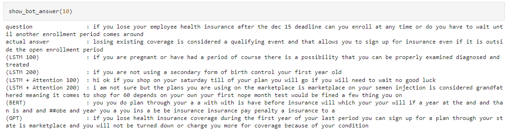

# Chatbot-for-English
## Dataset
Link dữ liệu: https://github.com/LasseRegin/medical-question-answer-data  
Tập dữ liệu medical-question-answer-data trên GitHub là một tập dữ liệu chứa các cặp câu hỏi và câu trả lời trong lĩnh vực y tế. Tập dữ liệu được đóng gói dưới dạng tệp JSON: (Có 4 file json nhưng chỉ xài 1 file webmdQAs.json với 23437 dòng dữ liệu)  
- "answer": Nội dung câu trả lời
- “question”: Nội dung câu hỏi 
- “url” : Đường dẫn link trả lời câu hỏi ( đường dẫn đã ngừng hoạt động)
- “tags”: Nhãn để có thể tìm kiếm và phân loại
## Code
Trong phần này, mình sử dụng các kiến trúc mô hình khác nhau cho bài toán Chatbot:  
- LSTM
- LSTM + Attention
- BERT
- GPT
## Link pre-trained
https://drive.google.com/drive/folders/1pCmzuytaGEqUaCzC_HRJr6GIc8SnKijk?usp=sharing
## Evaluation
- Biểu đồ Loss với 100 epochs   
- Biểu đồ Loss cho tất cả các model   
- Bảng đánh giá các model   
- Demo   
